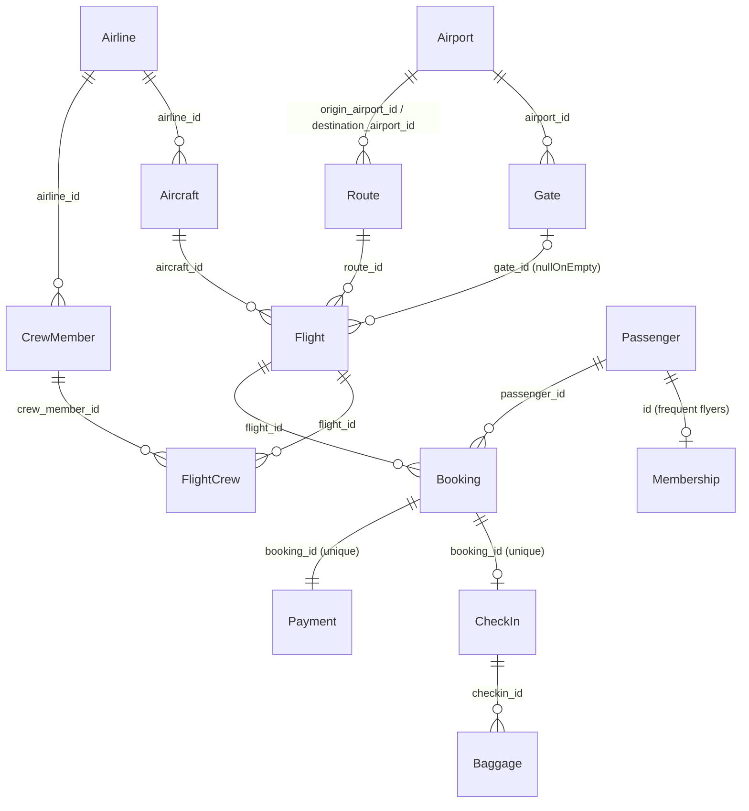

# Airline case

A flight network: airlines operate a fleet of regional aircraft on routes between airports; passengers book flights, check in, and dispatch baggage; crews are assigned to flights.

This is the most feature-dense case: besides the patterns of the other cases it exercises `chaca.sequence()`, `ref` with `nullOnEmpty`, self-exclusion refs (`origin ≠ destination`), interval-overlap constraints, capacity caps read from another entity, and deterministic unique seat generation.

## Entities

| Entity       | Documents               | Description                                                                 |
| ------------ | ----------------------- | --------------------------------------------------------------------------- |
| `Airline`    | 8                       | Operator of aircrafts and employer of crews.                               |
| `Airport`    | 30                      | IATA-like code via `replaceSymbols("???")`.                                |
| `Gate`       | 120                     | Boarding gate; belongs to an `Airport`.                                    |
| `Aircraft`   | 40                      | Small regional fleet (6–12 economy / 2–4 business seats) so the capacity rule actually binds. |
| `Route`      | 80                      | Origin ≠ destination; unique (origin, destination) pair; `duration_min` derived from `distance_km`. |
| `Flight`     | 150                     | `flight_number` via `chaca.sequence()`; departures within −3/+2 months.    |
| `CrewMember` | 200                     | Role via `probability`; `license_number` conditionally null for attendants. |
| `FlightCrew` | 350                     | M:N flight ↔ crew with airline consistency, pilot cap and per-flight cap.  |
| `Passenger`  | 250                     | `frequent_flyer_number` with `possibleNull: 0.6`.                          |
| `Membership` | one per frequent flyer  | 1:1 extension of `Passenger` (dynamic count + unique filtered ref).        |
| `Booking`    | 600                     | Class via `probability`; capacity-capped flight ref; derived `price`.      |
| `CheckIn`    | one per checked-in booking | Deterministic unique seat per flight; date inside the booking window.   |
| `Baggage`    | 250                     | `tag` via `chaca.sequence({ startsWith: 1000 })`; weight capped by class.  |
| `Payment`    | one per booking         | `amount` mirrors the booking price; refunds for cancelled bookings.        |

## Relationships

## Business rules encoded in the schemas

- **Route**: destination ref excludes the already-chosen origin (`where` using `currentFields`), and the (origin, destination) pair is deduplicated against `currentDocuments`. `duration_min = round(distance_km / 13) + 30`.
- **Flight**: `arrival = departure + route.duration_min`. Only `active` aircrafts fly, and the aircraft ref rejects candidates with an overlapping flight (interval check against `currentDocuments`). `gate_id` only accepts gates of the origin airport — with `nullOnEmpty: true`, so airports without gates yield `null` instead of failing. Status is time-coherent: future departures are `scheduled`/`boarding`/`cancelled`, past ones `departed`/`landed`/`cancelled`.
- **CrewMember**: `license_number` is `null` exactly for attendants (conditional `possibleNull`).
- **FlightCrew**: the crew member must belong to the airline of the flight's aircraft (flight → aircraft → airline chain inside the `where`), cannot be assigned twice to the same flight, and a flight accepts at most 4 crew assignments and at most 2 pilots. The per-flight cap also keeps the airline-consistent ref satisfiable — without it a flight could demand more crew than its airline employs.
- **Membership**: dynamic count + unique filtered ref — one membership per passenger with a frequent flyer number (1:1 inheritance pattern).
- **Booking**: the flight ref rejects `cancelled` flights and enforces the per-class capacity of the flight's aircraft (counting `currentDocuments`). A passenger cannot book the same flight twice. `price = distance_km × 0.12` (×2.5 for business). `booking_date` falls in the 120 days before departure and never in the future.
- **CheckIn**: one per `checked-in` booking. The seat is generated deterministically from the number of previous check-ins on the same flight (`1A`, `1B`, … `2A`), guaranteeing uniqueness without retries. `checkin_date` sits between the booking date and the departure.
- **Baggage**: `tag` is a global sequence; `weight_kg` is capped by the booking class (23kg economy / 32kg business).
- **Payment**: exactly one per booking (unique ref + dynamic count); `amount` mirrors the booking price; `cancelled` booking ⇒ `refunded` payment.

## Validations (in [airline.test.ts](airline.test.ts))

- **Routes**: origin ≠ destination, unique (origin, destination) pair, `duration_min` derived from distance.
- **Flights**: unique flight numbers starting at 100, `arrival − departure` equals the route duration, only active aircrafts, no overlapping flights per aircraft, gate (when present) belongs to the origin airport, `departed`/`landed` only for past departures.
- **Crew**: license presence matches the role, no duplicate (flight, crew member), at most 4 crew and 2 pilots per flight, crew airline equals the aircraft's airline.
- **Memberships**: count and ids match passengers with frequent flyer number, bronze outnumbers every other tier, points within range.
- **Bookings**: per-flight/class capacity never exceeded, exact price formula, no duplicate (passenger, flight), `booking_date` before departure, no bookings on cancelled flights.
- **Check-ins**: bijection with `checked-in` bookings, unique seat per flight, `checkin_date` inside the booking→departure window.
- **Baggage**: unique tags (validates `sequence`), weight within the class limit.
- **Payments**: exactly one per booking, `amount` equals the price, `cancelled` ⇒ `refunded` (otherwise `completed`/`pending`), `created_at` after the booking date.
