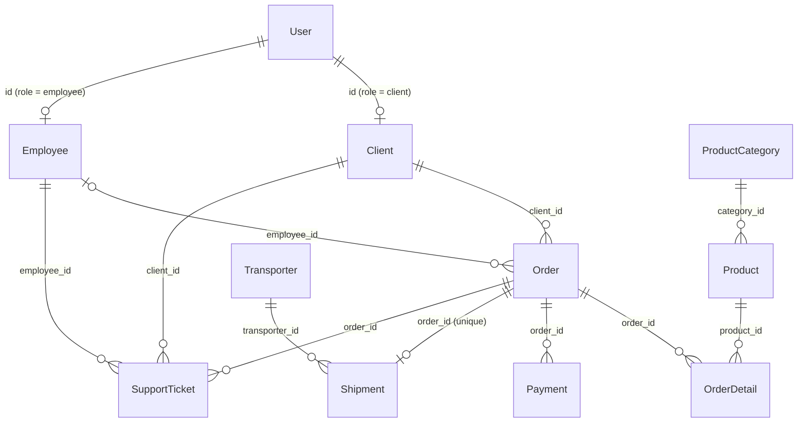

# Ecommerce case

An online store: users buy products, orders are paid, shipped by transporters, and supported through tickets.

## Entities

| Entity            | Documents             | Description                                                     |
| ----------------- | --------------------- | --------------------------------------------------------------- |
| `User`            | 100                   | Base identity. `role` is `client` (70%), `employee` or `admin`. |
| `Client`          | one per client user   | Extension of `User` (shared PK via unique ref).                 |
| `Employee`        | one per employee user | Extension of `User` (shared PK via unique ref).                 |
| `ProductCategory` | 20                    | Product grouping.                                               |
| `Product`         | 300                   | `price` is always ≥ `cost`.                                     |
| `Order`           | 30                    | Belongs to a `Client`; `employee_id` nullable.                  |
| `OrderDetail`     | 80                    | Order line. `unit_price` copied from the product; `subtotal = count × unit_price`. |
| `Payment`         | 6                     | `amount` copied from the order total.                           |
| `Transporter`     | 30                    | Delivery company.                                               |
| `Shipment`        | 20                    | One per order (`order_id` unique ref).                          |
| `SupportTicket`   | 20                    | Links client, employee and order.                               |

## Relationships

## Business rules encoded in the schemas

- **Client/Employee counts follow User roles**: their `documents` count is computed from the generated `User` table, and their `id` is a unique ref to `User.id` filtered by role — a 1:1 "table inheritance" pattern.
- **OrderDetail**: a product cannot be repeated within the same order, and the product must have been created before the order date. `unit_price` mirrors the referenced product's `price`.
- **Payment**: if the referenced order is `delivered`, the payment status is forced to `completed`; otherwise it's `pending` or `fail`. `amount` mirrors the order's `total`.
- **Shipment**: status follows the order (`delivered` order ⇒ `delivered` shipment); `send_date` only exists for shipments that left the warehouse, and `deliver_date` is always after `send_date`.
- **SupportTicket**: `created_at` is always after the referenced order's date; `close_date` only exists when the ticket is `closed`, and is always after `created_at`.
- **Temporal coherence**: products are at least 1 year old, orders happen within the last 6 months, and payments, shipments and support tickets always happen after their order.

## Validations (in [ecommerce.test.ts](ecommerce.test.ts))

- `Client` count equals users with role `client`, and every client's `id` maps back to a user with that role (same for `Employee`).
- Client levels follow the configured probability: `normal` clients outnumber `premium` and `vip`.
- `Product`: `price` ≥ `cost`.
- `OrderDetail`: distinct products within an order, `count` between 1 and 10, `unit_price` equals the referenced product's `price`, `subtotal = count × unit_price`, and the product was created before the order date.
- `Payment`: `amount` equals the order's `total`, `pay_date` is after the order date, and payments for `delivered` orders have status `completed`.
- `Shipment`: at most one shipment per order, `delivered` order ⇒ `delivered` shipment, `send_date` only exists (and is after the order date) once the shipment left the warehouse, and `deliver_date` only exists for `delivered`/`returned` shipments and is after `send_date`.
- `SupportTicket`: `created_at` is after the order date, and `close_date` only exists for `closed` tickets and is after `created_at`.
