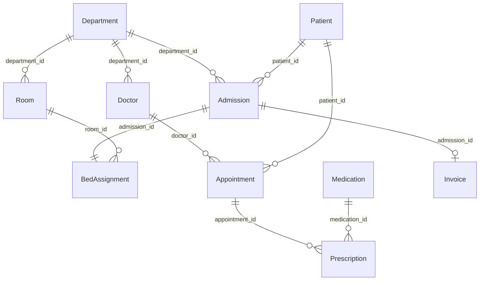

# Hospital case

A hospital: patients get admitted into departments, are assigned a bed, see doctors in appointments, get prescribed medication, and are billed on discharge.

## Entities

| Entity          | Documents                          | Description                                                              |
| --------------- | ----------------------------------- | ------------------------------------------------------------------------- |
| `Department`    | 8                                   | A hospital department (Cardiology, Emergency Medicine, etc).              |
| `Doctor`        | 30                                  | Belongs to a `Department`; `license_number` is sequential.                |
| `Patient`       | 200                                 | May be uninsured (`insurance_provider` is nullable).                     |
| `Room`          | 40                                  | Holds 1–4 beds (`capacity`).                                             |
| `Admission`     | 150                                 | A patient's stay in a department; `discharge_date` is null while active. |
| `BedAssignment` | one per admission                   | Links an admission to a room, respecting its capacity.                   |
| `Appointment`   | 400                                 | A patient seeing a doctor; status depends on whether it's past or future. |
| `Medication`    | 25                                  | Pharmacy stock; `code` is sequential.                                    |
| `Prescription`  | one per completed appointment       | Medication prescribed during a completed appointment.                    |
| `Invoice`       | one per discharged admission        | Billed once the patient is discharged.                                  |

## Relationships

## Business rules encoded in the schemas

- **Admission**: `patient_id` refuses a patient who already has another admission with `discharge_date = null` (a patient cannot be admitted twice at once). `discharge_date` is `null` 20% of the time (still admitted); otherwise it's a date between `admission_date` and now.
- **BedAssignment**: `room_id` only accepts a room whose currently active assignments (linked admission still without a `discharge_date`) are below its `capacity`.
- **Appointment**: `doctor_id` only accepts `active` doctors. `status` depends on whether `scheduled_date` is in the past or future, mirroring the airline case's `Flight.status`.
- **Prescription**: `appointment_id` only accepts `completed` appointments; `medication_id` only accepts medications with `stock > 0`.
- **Invoice**: `admission_id` only accepts discharged admissions (`discharge_date !== null`); `amount` resolves the admission → department chain to charge `nights * daily_rate`, the same "resolve the parent chain" pattern as the university case's `Payment.amount`.

## Validations (in [hospital.test.ts](hospital.test.ts))

- Doctors have 0–40 years of experience, and `license_number` is unique and sequential from 10000.
- No patient has two simultaneous active admissions, and `discharge_date` is always after `admission_date`.
- Every admission has exactly one bed assignment, and a room's active assignments never exceed its capacity.
- Only active doctors have appointments, and future appointments are only `scheduled` or `cancelled`.
- Prescriptions only reference completed appointments and medications that had stock.
- Invoices only reference discharged admissions, at most one per admission, and `amount` matches the nights-of-stay × department `daily_rate` computation.
- Rooms have 1–4 beds, patients are 0–100 years old, and medication codes are unique and sequential from 1000.
