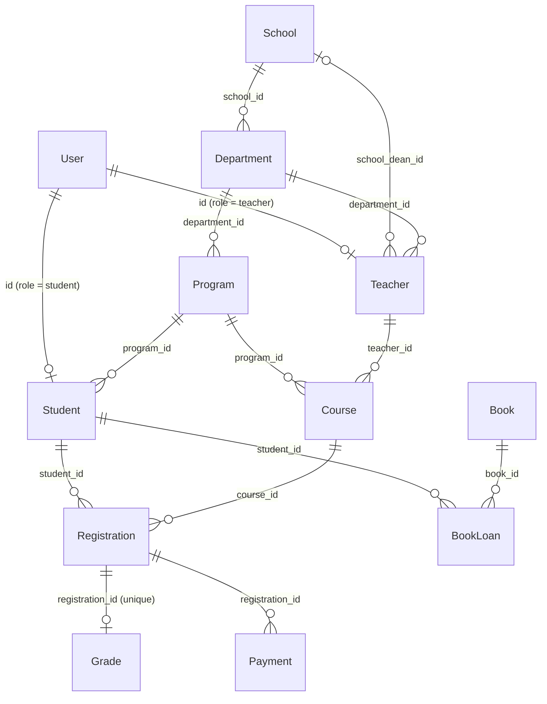

# University case

A university: students enroll in courses taught by teachers, get grades, pay for registrations, and borrow library books.

## Entities

| Entity         | Documents             | Description                                                        |
| -------------- | --------------------- | ------------------------------------------------------------------ |
| `User`         | 150                   | Base identity. `role` is `student` (70%), `teacher` or `admin`.    |
| `Student`      | one per student user  | Extension of `User`; always at least 16 years old.                 |
| `Teacher`      | one per teacher user  | Extension of `User`; belongs to a `Department`.                    |
| `School`       | 20                    | Top-level academic unit.                                           |
| `Department`   | 30                    | Belongs to a `School`.                                             |
| `Program`      | 35                    | Degree program; `period_duration` between 4 and 8.                 |
| `Course`       | 100                   | 1–10 credits; taught by a `Teacher`.                               |
| `Registration` | 120                   | A student enrolled in a course for a period (e.g. `2022-1`).       |
| `Grade`        | 120                   | One per registration (`registration_id` unique ref).               |
| `Payment`      | 200                   | Payment for an active registration; `amount` is the program cost.  |
| `Book`         | 60                    | Library stock.                                                     |
| `BookLoan`     | 30                    | A student borrowing a book.                                        |

## Relationships

## Business rules encoded in the schemas

- **Student/Teacher counts follow User roles**: same 1:1 "table inheritance" pattern as the ecommerce case.
- **Student**: `birthdate` guarantees a minimum age of 16, and `actual_period` never exceeds the program's `period_duration`.
- **Teacher**: `school_dean_id` is `null` unless the teacher is `active`.
- **Course**: an active course can only be taught by an `active` teacher.
- **Registration**: a student cannot enroll twice in the same course and period, and cannot exceed 20 credits per period.
- **Grade**: `final_grade` range depends on the registration status — `approved` ⇒ 60–100, `failed` ⇒ 0–59.
- **Payment**: only references `active` registrations; `amount` resolves the registration → course → program chain to charge the program's cost; a registration can have at most one non-failed payment.
- **BookLoan**: only books with stock (`count > 0`) can be borrowed; a student can hold at most 5 open loans (`loan`/`late`); `return_date` only exists for `returned` loans and is always after the loan `date`.

## Validations (in [university.test.ts](university.test.ts))

- Every grade belongs to exactly one registration, and a registration has at most one grade.
- Grade ranges match the registration status (`approved` ⇒ ≥ 60, `failed` ⇒ ≤ 59).
- No student is registered twice in the same course and period, and no student exceeds 20 credits per period.
- Courses have 1–10 credits, and active courses only have active teachers.
- Payments only reference `active` registrations, their `amount` equals the program's cost, and a registration has at most one non-failed payment.
- Books always have non-negative stock, and only books with stock can be loaned.
- A student has at most 5 open book loans, and returned loans have `return_date` > `date`.
- `Student`/`Teacher` counts match users with the corresponding role.
- Teachers who are not `active` have `school_dean_id = null`.
- Programs last between 4 and 8 periods, and all students are at least 16 years old.
- `actual_period` of a student never exceeds their program's `period_duration`.
